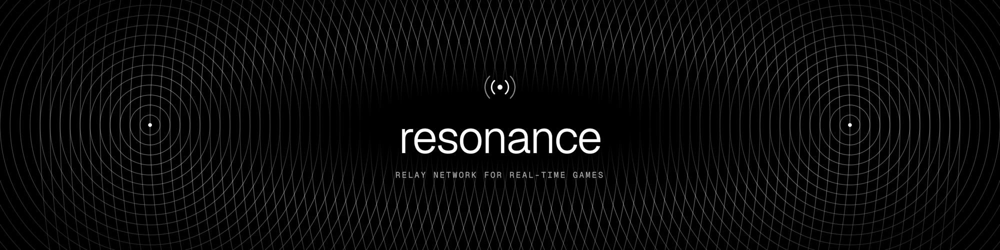
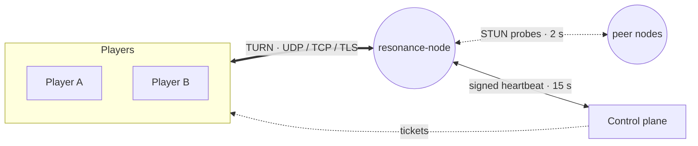

<p align="center">
  
</p>

<p align="center">
  <a href="https://github.com/gamerelay/resonance/actions/workflows/ci.yml"></a>
  <a href="https://github.com/gamerelay/resonance/releases/latest"></a>
  <a href="Cargo.toml"></a>
  <a href="docs/PROTOCOL.md"></a>
  <a href="LICENSE"></a>
  <br>
  
  
  
  <a href="https://github.com/gamerelay/resonance/commits/main"></a>
  <a href="https://github.com/gamerelay/resonance/graphs/commit-activity"></a>
</p>

<p align="center">
  <a href="docs/ARCHITECTURE.md">Architecture</a> ·
  <a href="docs/PROTOCOL.md">Protocol</a> ·
  <a href="CHANGELOG.md">Changelog</a> ·
  <a href="docs/BENCH-2026-09-29.md">Benchmark</a> ·
  <a href="docs/HANDOFF.md">Handoff</a> ·
  <a href="TECH_DEBT.md">Tech debt</a> ·
  <a href="CONTRIBUTING.md">Contributing</a> ·
  <a href="SECURITY.md">Security</a>
</p>

An easy-to-deploy relay network for real-time games. [GameRelay](https://gamerelay.io) is its
first customer.

This repo is the **node**: a room-scoped TURN relay in Rust. It replaced GameRelay's Go relay
in production, and is the base for the network's later roles.

**Status: v0, in production.** GameRelay's relays (San Francisco and New York) run it, joined
to GameRelay's registry (heartbeats, drain, revoke, tickets), measuring each other every
2 s. pion's and coturn's TURN clients and Chromium, Firefox and WebKit relay through it, over
UDP, TCP and TLS.

## At a glance

- **Fast.** ~0.2 ms median relay time, flat to 2,000 pairs, at about a fifth of the Go relay's
  CPU and 15–20× less memory per allocation ([benchmark](docs/BENCH-2026-09-29.md)).
- **Closed by design.** It only relays between allocations of the same room on the same node,
  so it is never an open proxy, and it can't read what it relays.
- **Credentials without shared secrets.** Any trusted issuer (a control plane, or a game's own
  server) signs tickets that nodes check by key agreement, with rooms scoped by issuer.
- **Gets through firewalls.** UDP, TCP and TLS on 443, reloading its certificate when it's
  renewed.
- **Watches itself.** Nodes probe each other from their relay sockets, and the control plane
  alerts on a node that's silent, unreachable, restarting or near its certificate's expiry. Nodes
  alert on the control plane too.
- **One binary.** `join <token>`, then `run`. Its identity is an ed25519 key that never leaves
  the box.
- **Tested against real clients.** A sans-I/O core with conformance vectors and a fuzz run, plus
  pion, coturn and three browser engines in CI.



## What it relays, and to whom

- **Only between allocations of the same room, on this node.** Both players of a pair allocate on
  the same node, so the only permitted peer is the node itself. Every relayed packet goes from one
  allocation to another in memory: relay addresses are names, not sockets. It is never an open
  proxy, and nothing else on the machine is reachable through it.
- **It can't read what it relays.** Players' WebRTC traffic is DTLS end to end.
- **No shared secret.** Players hold tickets signed by an issuer the node trusts, each with a
  password for this node only (docs/PROTOCOL.md, "Tickets"). A leaked node can compute passwords
  for tickets sent to it, but can't mint any.
- **Limits:** 8 allocations per player, 64 per client IP, 4,096 per game, and 128 KB/s per
  allocation (256 KB burst). Unsigned answers to unknown clients are capped at 20 a second per IP
  (burst: the per-IP cap), since a spoofed source could otherwise aim them at someone. All of
  them are settings (`TURN_MAX_PER_PLAYER`, `TURN_MAX_PER_IP`, `TURN_MAX_PER_INSTANCE`,
  `TURN_UNAUTH_RATE`, `TURN_UNAUTH_BURST`, `TURN_RATE_BYTES`, `TURN_BURST_BYTES`; see
  `crates/resonance-node/src/main.rs`). Every player holds an allocation per other player even
  when the LAN route wins, so a school or office behind one NAT may need a higher
  `TURN_MAX_PER_IP`: 8 players in a room take 56.

## Layout

| Crate | What it does |
|---|---|
| [`resonance-turn`](crates/resonance-turn) | The TURN relay, sans-I/O: `handle(now, from, packet) → packets`. Every rule lives here, testable without sockets. Its own STUN codec: parsed in place, nothing allocated per packet. Stream framing for TCP and TLS. |
| [`resonance-proto`](crates/resonance-proto) | The control plane's wire types: node ids, signed requests, join, heartbeat (with the sealing key and the issuers to trust). Fixtures shared with the control plane. |
| [`resonance-node`](crates/resonance-node) | The node: a library (the event loop over the UDP socket and the TCP and TLS listeners; joining, heartbeats, the issuers it trusts) and a thin binary that reads the settings and runs it. |
| [`interop`](interop) | Other clients against the built node: pion's over UDP, TCP and TLS (`go test`), coturn's (`coturn.sh`), and Chromium, Firefox and WebKit's own (`browsers/relay.mjs`, every pairing, `TRANSPORT=udp\|tcp\|tls`). Also the benchmark (`cmd/bench`). |

## Running a node

**Joined to the network** (a token from the control plane's admin, valid an hour, used once):

```sh
cargo build --release
export TURN_PUBLIC_IP=<its public IP>        # where players reach it
./target/release/resonance-node join <token> # once: makes its key, registers it
./target/release/resonance-node run          # a heartbeat every 15 s
./target/release/resonance-node status
```

The node's ed25519 key and registration stay in `RESONANCE_STATE_DIR` (default
`/var/lib/resonance`); the key never leaves the box. `RESONANCE_CONTROL` is the control plane
(default `https://gamerelay.io`; https only, except on localhost). While it's active and heard from, the control plane hands it out
to players with tickets it signs, and tells it whose tickets to take; draining it stops new
allocations, and revoking it stops the node.

**On its own** (self-hosted, no control plane): it takes the tickets of the issuers you name.

```sh
./target/release/resonance-node issuer issuer.key   # makes an issuer key, prints its public key
RESONANCE_ISSUERS=<that public key> TURN_PUBLIC_IP=<its public IP> ./target/release/resonance-node
./target/release/resonance-node seal-key            # what tickets for this node are minted with
./target/release/resonance-node mint issuer.key <seal key> <instance> <room> <player> [seconds]  # username, password; 3600 s by default, at most a day
```

Your game's server mints tickets the same way (docs/PROTOCOL.md, "Tickets"); `mint` is the
minimal version.

Either way it listens on UDP 3478 (`TURN_PORT`). Relay addresses use ports 49152–65535
(`TURN_MIN_PORT`, `TURN_MAX_PORT`), but nothing listens on them, so they need no firewall opening.

**TCP and TLS**, for networks that block UDP. Players on streams and on UDP relay to each other.

```sh
TURN_TLS_CERT=/path/fullchain.pem TURN_TLS_KEY=/path/privkey.pem \
TURN_TLS_PORT=443 TURN_TLS_HOST=turn.example.com ./target/release/resonance-node   # turns:
TURN_TCP=1 ./target/release/resonance-node                                          # turn:…?transport=tcp
```

The certificate files are read again when they change (a renewal needs no restart). Use an RSA
certificate from a public CA: WebKit's TURN client trusts only roots built into it. The node's
URLs go with its join and every heartbeat, so the control plane hands out the new ones.

## Tests

```sh
cargo test --release                                     # the core, a fuzz run, and the loop in-process
FUZZ_ITERS=5000000 cargo test --release --test fuzz      # a longer fuzz run
cd interop && go test ./...                              # pion's client against the node
interop/coturn.sh                                        # coturn's client (needs coturn installed)
# Chromium, Firefox and WebKit, every pairing (Linux: Firefox leaves loopback out of ICE), with
# the node built for Linux; TRANSPORT=tcp, or TRANSPORT=tls BROWSERS=chromium,firefox (needs
# libnss3-tools in the container):
docker run --rm -v "$PWD":/w -w /w/interop/browsers mcr.microsoft.com/playwright:v1.63.0-noble \
  sh -c 'npm i --no-save playwright@1.63.0 && NODE_BIN=/w/target/release/resonance-node node relay.mjs'
```

`crates/resonance-turn/tests/conformance.rs` holds what other TURN servers and the browsers'
clients check: RFC 5769's vectors, real Chrome and Firefox captures (`tests/testdata`, from pion),
coturn's and eturnal's auth corner cases, and libwebrtc's and nICEr's behavior on the wire.

How it's built and why: [docs/ARCHITECTURE.md](docs/ARCHITECTURE.md). The wire formats, for
players and for the control plane: [docs/PROTOCOL.md](docs/PROTOCOL.md). The original design is
in GameRelay's repo: `docs/superpowers/specs/2026-09-29-resonance-v0-design.md`.

## License

[MIT](LICENSE)
