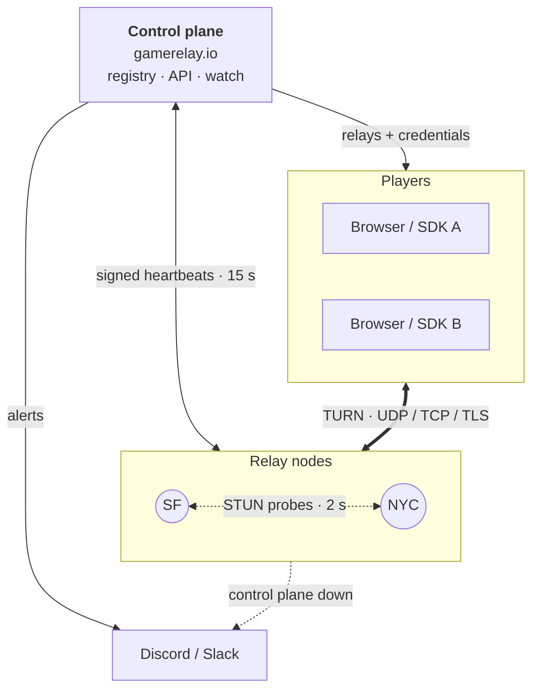
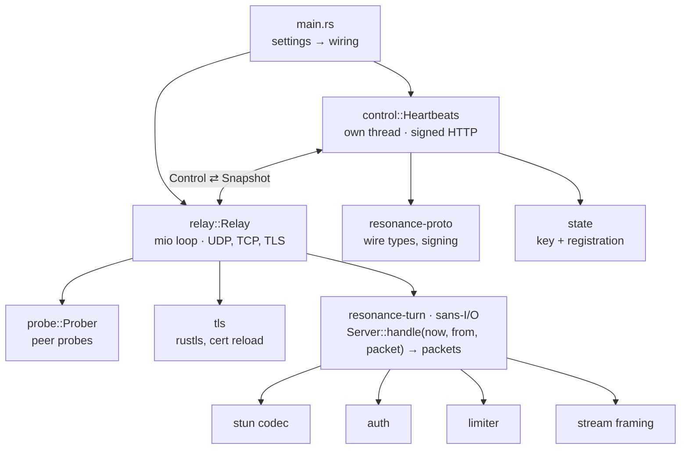

# Architecture

How Resonance is put together, and why. The wire formats are in [PROTOCOL.md](PROTOCOL.md).

## The network

The network has three roles:

- **Players.** A browser or a game using the SDK asks its game's server for relays. It gets each
  live node's URLs and a short-lived credential for each. Both players of a pair pick the same
  node, and their WebRTC traffic goes through it, DTLS end to end.
- **The control plane.** It holds the registry (nodes, regions, statuses, key versions) and the
  master key. It mints node keys and players' credentials, and it watches the nodes. GameRelay is
  the first one; the API is open, so another can be run (see "Where it's going" below).
- **Nodes.** A node is one binary on a small VM. It relays for players, reports to the control
  plane, and measures its peers. It holds its own ed25519 identity and a key that is good for
  this node only.

## Trust

| If this leaks | What it allows | What it doesn't |
|---|---|---|
| A player's credential | Relaying, for that room and player, on that node, until it expires | Any other room, player or node |
| A node's TURN key | Minting credentials for that node | Any other node: each key is derived from the master and the node id |
| A node's ed25519 key | Fetching that node's TURN key and heartbeating as it | Anything once the node is revoked in the admin |
| The master | Everything | Lives only on the control plane |

The design also holds the following:

- **A node can't be an open proxy.** The only permitted peer is the node itself, and relay
  addresses are names, not sockets (PROTOCOL.md, "The room rule"). A compromised credential
  reaches other allocations in the same room, nothing else.
- **A node can't read what it relays.** The node never sees plaintext.
- **The node is safe to point at the internet.** The answers it sends to sources it doesn't know
  are rate-limited per IP, so it can't be used to reflect traffic at a third party. Nonces are
  bound to the client's address, and every allocation limit is per player, per IP and per game.
- **Control requests can't be forged or replayed.** Each one is signed, timestamped within 30 s,
  and remembered.

## Inside a node

### A sans-I/O core

`resonance-turn` holds every TURN rule and touches no sockets and no clock: it is given the time,
an address and the bytes. That has several consequences:

- **Testing.** Every rule is tested in-process, deterministically, at the speed of a function
  call. This covers the Go relay's tests (ported), RFC 5769's vectors, real Chrome and Firefox
  captures, and coturn's and eturnal's corner cases.
- **Fuzzing.** It can be fuzzed on stable Rust. CI runs 2 million iterations.
- **Transports.** UDP, TCP and TLS drive the same core: a stream client is just another
  `Client { addr, conn }`.
- **Allocations.** No packet allocates. STUN is parsed in place, and answers are written into
  one reusable buffer.

### One event loop

`relay::Relay` is a single mio loop over the UDP socket, the TCP and TLS listeners and every open
connection. The core needs no locks because only this thread touches it, and each message is
read, handled and answered in one go.

- **Fairness.** Each turn of the loop reads at most 1,024 datagrams from UDP and 256 KB from any
  one stream, so a busy client can't starve the rest.
- **Back-pressure.** Each stream has its own outgoing queue (`Outbox`), capped at 256 KB. Past
  that, whole messages are dropped and the connection stays open. Games prefer a lost frame to a
  dropped player.
- **Timers.** Once a second the loop expires allocations, permissions and stream deadlines, and
  sends due probes. Once a minute it logs a stats line.

### The control thread

`control::Heartbeats` runs on its own thread and talks to the loop through two channels:

- **To the loop**, `Control` messages: a new key, drain, revoke, the peer list.
- **From the loop**, a `Snapshot`: allocations, bytes, peer reports.

Neither waits on the other. A control plane that is slow or down never stalls relaying; the node
keeps its key and carries on. If it stays unreachable, the node raises its own alert.

### Settings

`Settings::from_lookup` reads every setting once at startup, from any key-value lookup, and
returns errors instead of exiting. That makes the settings unit-testable, and `join` checks all of
them up front.

## Observing the network

Each node probes every other node every 2 s from its relay socket, and reports the last 30 s in
its heartbeat. The control plane keeps 24 h of samples and builds three things from them:

- **The network view.** In GameRelay's admin: a live map of nodes and links, with probes animated
  out and back, an inspector for each node and link, and sparklines.
- **Alerts.** One message when a problem starts and one when it ends, retried until delivered.
  The problems it alerts on:
  - a node gone silent;
  - a node no peer's probes reach;
  - a restart;
  - a TLS certificate within 14 days of expiry, or failing.
- **Outward alerts from the nodes.** A node can't tell the control plane that the control plane is
  down, so each node watches it too and posts to the same webhook.

## Performance

[docs/BENCH-2026-09-29.md](BENCH-2026-09-29.md) has the full benchmark against GameRelay's Go
relay (pion/turn):

- **Latency.** A flat ~0.2 ms median relay time up to 2,000 pairs. The Go relay goes from 1 ms to
  31 ms over the same range, and drops 8% of packets at the top.
- **Resources.** About a fifth of the CPU, and 15–20 times less memory per allocation.
- **The release build.** LTO and one codegen unit; `panic = "abort"`.

## Compatibility

The node is checked against the clients that real players use, in CI on every push:

| Client | Transports |
|---|---|
| pion/turn (Go) | UDP, TCP, TLS |
| coturn's `turnutils_uclient`, six modes | UDP, TCP |
| Chromium, Firefox, WebKit (every pairing, relay-only ICE) | UDP, TCP; TLS for Chromium and Firefox |

WebKit's TURN client trusts only its built-in roots, so TLS for WebKit is checked against a real
certificate rather than a test CA.

## Where it's going

v0 is a relay network with one control plane. The order from here:

1. **Topology.** Nodes measure each other, and the network view shows it (done).
2. **Private nodes.** A customer runs nodes for their own games, joined to the same control
   plane.
3. **Gossip.** Nodes share what they measure directly, not only through the control plane.
4. **Forwarding.** When players are far apart, a pair can relay over two nodes with a fast link
   between them.
5. **Distributed signaling.** If the control plane is down, the mesh keeps finding relays for
   players on its own.

The control plane's API is versioned by date and changes additively within a version, so nodes
from different releases keep working side by side throughout.
